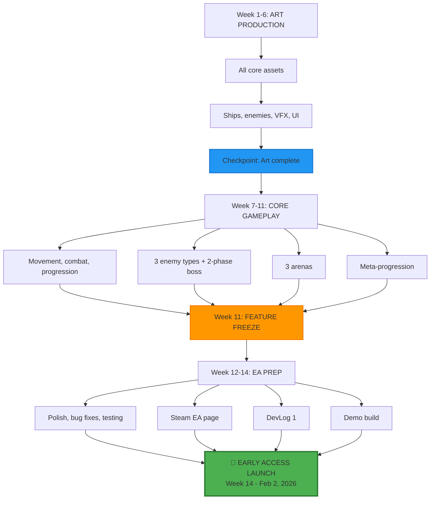
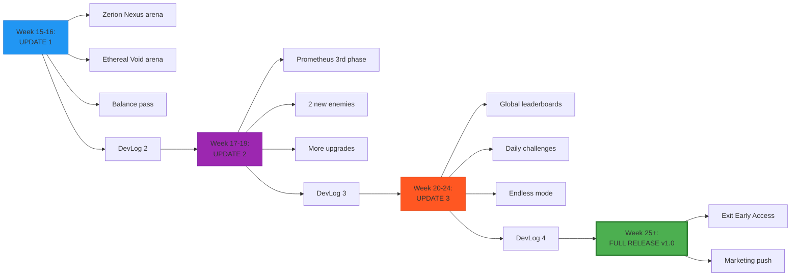

# Early Access Strategy

**Project:** The Invasion: Reforged  
**Plan:** Early Access → Full Release  
**Created:** November 3, 2025

---

## Why Early Access Works Here

### What's Wrong with Traditional Launch

Traditional v1.0:
- Must ship "complete" - pressure to include all 5 arenas and 3-phase boss
- No player feedback - design locked in
- One shot at launch - hard to recover if it flops
- 19 weeks until revenue - cash flow delayed

Early Access:
- Ship MVP - 3 arenas and 2-phase boss is enough
- Get player feedback - iterate on real data
- Multiple launch moments - each update brings new players
- Revenue at week 14 - fund the rest of development

---

## Timeline



**Changes from original plan:**
- Launch week 14 instead of 19
- 3 arenas is enough for EA
- 2-phase boss works for EA
- "More content coming" is the whole point of EA

---

### Phase 2: Content Updates (Weeks 15-20+)


```
├─ Price increase ($7.99 → $9.99)
└─ Launch on additional platforms (Epic, consoles?)
```

---

## Business Side

### Revenue
- EA Price: $7.99 (20% off full $9.99)
- Early adopter bonus: Exclusive ship skin
- Cash from week 14 funds the rest
- Lower risk: Can pivot if sales suck

### Marketing
- Multiple launches: Each update gets Steam visibility
- Streamer bait: "New update dropped" = fresh content
- **Player Retention:** Regular updates keep community engaged
- **Word of Mouth:** EA players evangelize to friends ("It's getting better!")

### Development Benefits
- **Real Player Data:** Heatmaps, death locations, progression curves
- **Balance Feedback:** "Atlas too tanky" or "Cryovex too easy"
- **Bug Discovery:** Players find edge cases you'd never test
- **Feature Validation:** Do players actually want leaderboards? Ask them!

---

## 🎮 What's Included in Early Access v0.8

### ✅ Core Gameplay (Fully Playable)
- Player ship with complete movement and combat
- Auto-fire weapons + 3 active abilities
- 3 enemy types (Falcon, Sentry, Atlas)
- Basic boss fight (Prometheus - 2 phases)
- XP and level-up system
- Temporary in-run upgrades (8-10 types)

### ✅ Meta-Progression (Fully Functional)
- Alien Hangar hub
- Scrap currency and spending
- Permanent upgrades (6 categories)
- Quantum Entropy Matrix
- Save/load system

### ✅ Content (Minimum Viable)
- 3 planetary arenas with unique effects
- 15-20 minute average run time
- 10+ hours to unlock all permanent upgrades
- Replayability through roguelite randomness

### ✅ Polish (Professional Quality)
- Low-poly + VHS aesthetic fully realized
- All VFX, SFX, UI polished
- 60 FPS on target hardware (GTX 1060)
- Mobile version (iOS/Android)

### ⚠️ Explicitly "Coming in EA" (Roadmap)
- ❌ 2 additional arenas (Zerion, Ethereal)
- ❌ Boss 3rd phase
- ❌ Leaderboards and challenges
- ❌ Endless mode
- ❌ Additional ship variants

**Early Access Disclaimer (Steam Page):**
> "The Invasion: Reforged is in Early Access with a complete core gameplay loop. We're adding more arenas, boss phases, and competitive features based on your feedback. Expected EA duration: 3-4 months."

---

## 📊 Early Access Launch Criteria

### GO (Ready for Early Access)
✅ **Core Loop Fun:** 3+ playtesters say "one more run"  
✅ **Stable:** No critical bugs, 60 FPS on target hardware  
✅ **Content:** 10+ hours of gameplay to unlock everything  
✅ **Polish:** Looks professional in screenshots/trailer  
✅ **Complete Systems:** All features work (no placeholders)

### NO-GO (Delay 1-2 Weeks)
❌ **Fun Factor:** Playtesters say "it's okay, I guess"  
❌ **Crashes:** Any reproducible crash bugs  
❌ **Performance:** Dips below 45 FPS on target hardware  
❌ **Content:** Only 3-5 hours to unlock everything  
❌ **Placeholder Art:** Any "temp" assets visible

---

## 🗣️ Communication Strategy

### Steam Early Access Page

**"About This Game" Section:**
```
The Invasion: Reforged is a 3D space shooter roguelite where you play as an 
alien pilot defending Earth from human invaders. Combine weapons, dodge bullet 
patterns, and upgrade your ship in this retro low-poly arcade experience.

EARLY ACCESS FEATURES:
✅ Complete core gameplay loop (movement, combat, progression)
✅ 3 unique planetary arenas with environmental effects
✅ Epic boss fight with multiple phases
✅ Deep meta-progression system with permanent upgrades
✅ 10+ hours of replayable roguelite content
✅ Retro VHS aesthetic with modern polish

COMING SOON (Early Access Roadmap):
🔄 2 additional arenas (Zerion Nexus, Ethereal Void)
🔄 Enhanced boss fight with 3rd phase
🔄 Global leaderboards and daily challenges
🔄 Endless survival mode
🔄 Additional ship variants

Expected Early Access Duration: 3-4 months
```

### DevLog 1: "Why Early Access?"

**Talking Points:**
- "We want YOUR feedback to shape the final game"
- "Core gameplay is polished and fun TODAY"
- "Regular content updates every 2-3 weeks"
- "Early Access price: $7.99 (20% off full $9.99)"
- "Exclusive ship skin for Early Access supporters"

### Roadmap Transparency

**Public Trello Board / Discord Channel:**
- Week 15-16: Arena Expansion
- Week 17-19: Boss Enhancement
- Week 20-24: Leaderboards & Endless
- Week 25+: Full Release v1.0

**Update players weekly:**
- "This week: Working on Zerion Nexus arena"
- "Bug fixes based on your reports"
- "Next update ETA: 2 weeks"

---

## 🎯 Success Metrics (Early Access)

### Week 1-2 Post-Launch
- **Sales:** 100-500 copies (realistic for indie EA)
- **Reviews:** 75%+ positive (Very Positive on Steam)
- **Retention:** 40%+ players return Day 2
- **Session Length:** 20+ minutes average

### Week 4 (First Update)
- **Sales Bump:** +50-100% sales spike on update day
- **Reviews:** Maintain 75%+ positive
- **Engagement:** 30%+ active players (played in last week)

### Week 12 (Leaderboards Update)
- **Sales:** 1,000+ total copies (word of mouth + updates)
- **Reviews:** 80%+ positive (content updates = happy players)
- **Retention:** 25%+ still playing (core fans)

### Week 16 (Full Release)
- **Sales:** 2,000-5,000 total copies
- **Reviews:** 80%+ positive (polished, content-complete)
- **Press:** Covered by indie game sites ("EA success story")

---

## 🛡️ Risk Mitigation (Early Access Specific)

### Risk: "Early Access = Abandoned Project" Stigma
**Mitigation:**
- Weekly dev updates (even if small)
- Public roadmap with realistic dates
- Deliver on promises (hit update ETAs)
- Full transparency about timeline

### Risk: Negative Reviews ("Not Enough Content")
**Mitigation:**
- Explicit roadmap on Steam page
- Emphasize "complete core loop, more content coming"
- Price reflects EA status ($7.99 not $9.99)
- Engage with reviewers, address feedback

### Risk: Early Players Burn Out Before Full Release
**Mitigation:**
- Don't over-promise ("New content every week!" = burnout)
- Space updates 2-3 weeks apart (time to digest)
- Add optional challenges, not mandatory grind
- Save major features (leaderboards) for later (brings players back)

### Risk: Can't Exit EA (Perpetual Development Hell)
**Mitigation:**
- **Hard deadline:** Week 25 = Full Release v1.0 (no matter what)
- Minimum viable roadmap (not endless feature adds)
- "Full Release" = leaderboards + 5 arenas + 3-phase boss (achievable)

---

## 📋 Updated Production Schedule (Early Access)

### REVISED TIMELINE: 14 Weeks to Early Access Launch

```
PHASE 1: ART (6 weeks) ← UNCHANGED
Week 1-6: Model everything (ships, enemies, arenas, UI)
Checkpoint: All art complete (Dec 15)

PHASE 2: CODE (5 weeks) ← SHORTENED FROM 8 WEEKS
Week 7: Core systems (movement, combat)
Week 8: Enemy AI (3 types)
Week 9: Progression + meta-progression
Week 10: Basic boss (2 phases) + 3 arenas
Week 11: FEATURE FREEZE

PHASE 3: EA LAUNCH (3 weeks) ← SHORTENED FROM 5 WEEKS
Week 12: Polish + bug fixes
Week 13: EA page, demo, trailer
Week 14: EARLY ACCESS LAUNCH (Feb 2, 2026)

PHASE 4: EA CONTENT UPDATES (Weeks 15-24)
Week 15-16: Content Update 1 (2 arenas)
Week 17-19: Content Update 2 (boss 3rd phase)
Week 20-24: Content Update 3 (leaderboards)

PHASE 5: FULL RELEASE (Week 25+)
Week 25: Exit Early Access (Full v1.0)
```

**Key Savings:**
- Code phase: 8 weeks → 5 weeks (cut boss 3rd phase, 2 arenas)
- Launch phase: 5 weeks → 3 weeks (no "perfect" polish needed)
- Total to EA: 14 weeks (saves 5 weeks vs. original 19-week plan)

---

## 💡 Why This is BETTER Than Original Plan

### Original Plan (19 Weeks to Full v1.0)
- ❌ No revenue until Week 19
- ❌ No player feedback until Week 19
- ❌ High pressure to be "perfect" at launch
- ❌ One shot at success
- ❌ 5 arenas, 3-phase boss = high risk

### Early Access Plan (14 Weeks to EA)
- ✅ Revenue from Week 14 onward
- ✅ Player feedback from Week 14 (shape future updates)
- ✅ Lower pressure ("it's Early Access, more coming")
- ✅ Multiple launch moments (each update = new sales spike)
- ✅ 3 arenas, 2-phase boss = achievable, polished

**Bottom Line:**
- **Faster to market** (14 weeks vs. 19 weeks)
- **Lower risk** (validate market before full investment)
- **Better outcomes** (real feedback shapes development)
- **More revenue** (EA price + full release price bump)

---

## ✅ Decision: Early Access or Traditional Launch?

### Early Access (RECOMMENDED)
**Pros:**
- Launch 5 weeks sooner (Week 14 vs. Week 19)
- Revenue starts earlier
- Player feedback shapes final game
- Multiple marketing moments
- Lower pressure (explicit "more coming")

**Cons:**
- "Early Access" stigma (some players avoid)
- Must deliver on roadmap promises
- Requires ongoing communication/updates

**Best For:** Solo dev, first commercial game, iterative design

---

### Traditional v1.0 Launch
**Pros:**
- "Complete" game at launch (better reviews?)
- One marketing push (simpler)
- No ongoing commitment (ship and move on?)

**Cons:**
- 5 weeks longer to revenue
- No player feedback before launch
- Higher pressure (must be "perfect")
- Miss opportunity for EA hype cycle

**Best For:** Established studio, known IP, "complete vision"

---

## 🎯 RECOMMENDED: Early Access Launch

**Timeline:**
- Week 1-6: Art (unchanged)
- Week 7-11: Core gameplay (3 arenas, 2-phase boss)
- Week 12-14: EA prep and launch
- Week 15-24: Content updates (2 arenas, boss phase, leaderboards)
- Week 25+: Full Release v1.0

**Scope:**
- EA Launch: 3 arenas, 2-phase boss, full meta-progression
- Update 1: +2 arenas
- Update 2: +boss 3rd phase
- Update 3: +leaderboards
- Full v1.0: Everything complete, exit EA

**Pricing:**
- Early Access: $7.99
- Full Release: $9.99
- Mobile: $4.99 (both EA and full)

---

## 📝 Next Steps (If Choosing Early Access)

### This Week (Nov 4-10)
1. ✅ Decide: Early Access or Traditional Launch?
2. Update MASTER_PRODUCTION_SCHEDULE.md to 14-week EA timeline
3. Update GDD.md with EA scope (3 arenas, 2-phase boss)
4. Update LAUNCH_PLAN.md with EA strategy

### Week 1-6 (Art Phase)
- No changes (art production same regardless)

### Week 7-11 (Code Phase - FOCUSED)
- Build ONLY EA scope (don't get distracted)
- 3 arenas, 2-phase boss, full meta-progression
- Week 11: Feature freeze (no additions)

### Week 12-14 (EA Launch)
- Steam Early Access page setup
- Public roadmap (Trello, Discord)
- DevLog 1: "Why Early Access?"
- Demo build
- Launch!

---

**Early Access = Ship sooner, learn faster, earn revenue earlier. Perfect for your project.** 🚀

---

*Last Updated: November 3, 2025*  
*Status: Recommended strategy (pending your decision)*

