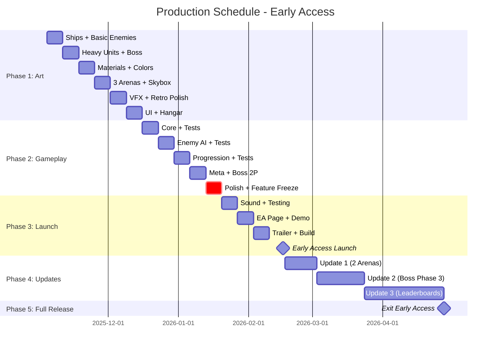

# Production Schedule - Early Access

**Project:** The Invasion Reforged  
**Strategy:** Early Access → Full Release  
**EA Launch:** 14 Weeks (Nov 4, 2025 → Feb 16, 2026)  
**Full Release:** Week 25+ (Apr 28, 2026+)  
**Developer:** Anderson Gonçalves (solo)  
**Weekly Hours:** 40-50 realistic, 60-70 aggressive

---

## How This Works

### Art First
Make all the art before coding. This gives me polished assets for devlogs 2-3 weeks before launch, when marketing matters most.

### Clean Architecture
Build everything with multiplayer in mind, even if it ships single-player. Unit tests for everything. SOLID principles.

### Why Early Access
- Launch 5 weeks sooner
- Revenue from week 14
- Player feedback shapes development
- Multiple marketing moments
- Less pressure ("more content coming")

---

## Timeline Overview



---

## Week by Week Details

### PHASE 1: ART (Weeks 1-6)

**Week 1: Player Ship + Basic Enemies** (Nov 4-10)

| Task | Details | Tris | Hours |
|------|---------|------|-------|
| Player ship model | Geometric alien craft | 800-1500 | 12h |
| Falcon Mk I (enemy) | Triangular fighter | 500-800 | 8h |
| Sentry-03 (enemy) | Orbital drone | 400-700 | 6h |
| VHS filter prototype | Scanlines, chromatic aberration | N/A | 8h |
| Unity project setup | URP, Post-Processing, Git | N/A | 6h |

**Deliverables:**
- [ ] 3 low-poly models in Unity
- [ ] VHS filter working
- [ ] First aesthetic screenshot
- [ ] Git repository initialized

**Risk:** VHS filter too subtle → Tune to 80s arcade aesthetic  
**Success Metric:** Screenshot looks intentionally retro, not unfinished

---

#### **Week 2: Heavy Units + Boss Model** (Nov 11-17, 2025)
**Focus:** Complex enemy models

| Task | Details | Tris | Hours |
|------|---------|------|-------|
| Atlas (heavy bomber) | Tanky, slow | 1000-1500 | 10h |
| Raven-IX (kamikaze) | Fast, explosive | 400-600 | 6h |
| Prometheus boss | Modular capital ship | 2000-3000 | 16h |
| Aegis Node (turret) | Stationary defense | 300-500 | 4h |
| Model refinement | Iterate Week 1 models | N/A | 6h |

**Deliverables:**
- [ ] 4 additional enemy models
- [ ] Boss with modular parts (shield generators)
- [ ] All models UV unwrapped

**Risk:** Boss too complex → Simplify phase mechanics if needed  
**Dependencies:** Week 1 models must be done

---

#### **Week 3: Materials & Colors** (Nov 18-24, 2025)
**Focus:** Retro color palette + flat shading

| Task | Details | Hours |
|------|---------|-------|
| Player ship materials | Cyan (#00FFCC) + magenta emissive | 6h |
| Enemy materials | Gray hull + red warning lights | 8h |
| Boss materials | Metallic + glowing weak points | 6h |
| Color palette documentation | Reference guide | 2h |
| VHS filter tuning | Final aesthetic pass | 6h |
| Material library setup | Reusable materials | 4h |

**Deliverables:**
- [ ] All models with flat-shaded materials
- [ ] Emissive materials for glows
- [ ] Color palette guide (PDF/image)
- [ ] VHS filter settings profile

**Risk:** Colors don't pop with VHS filter → Increase saturation  
**Quality Gate:** Colors remain distinct with filter enabled

---

#### **Week 4: Environments + Skyboxes** (Nov 25-Dec 1, 2025)
**Focus:** 3 planetary arenas for Early Access (2 more in Update 1)

| Arena | Color Theme | Gameplay Effect | Hours |
|-------|-------------|-----------------|-------|
| Aureon Prime | Orange (#FF6600) | Reduced visibility fog | 8h |
| Cryovex | Cyan (#00CCFF) | Slower projectiles | 8h |
| Voltra-9 | Red (#FF0000) | Heat damage when static | 8h |
| Props (asteroids, debris) | 100-300 tris each | N/A | 8h |
| Arena lighting & boundaries | Shared across 3 arenas | N/A | 6h |

**Deliverables:**
- [ ] 3 distinct skyboxes (gradient-based)
- [ ] 20+ low-poly props
- [ ] Arena lighting setups
- [ ] Arena boundary models

**Post-EA (Update 1 - Weeks 15-16):**
- Zerion Nexus (Gray - Radar interference) - 8h
- Ethereal Void (Purple - Gravity distortion) - 8h

**Risk:** Arenas look too similar → Emphasize color differentiation  
**Success Metric:** Can identify arena within 2 seconds

**Time Saved vs Original Plan:** 16 hours (2 arenas deferred to Update 1)

---

#### **Week 5: VFX + Particle Systems** (Dec 2-8, 2025)
**Focus:** Retro-style effects

| Effect Type | Description | Particles | Hours |
|-------------|-------------|-----------|-------|
| Plasma beam | Cyan additive trail | 50/sec | 4h |
| Ion cannon | Orange expanding ring | Burst 20 | 4h |
| Explosions | Orange-yellow burst | Burst 30 | 6h |
| Scrap collection | Blue attraction particles | 5 per pickup | 4h |
| Level-up | Screen flash + geometric burst | Burst 15 | 4h |
| Shield/damage | Color flash overlays | N/A | 4h |
| Engine trails | Subtle particle streams | 20/sec | 4h |
| Environmental | Space dust, debris | 10/sec | 4h |

**Deliverables:**
- [ ] 15+ particle systems
- [ ] All VFX work with VHS filter
- [ ] Performance-optimized (<5000 particles total)

**Risk:** VFX too modern → Keep particles geometric, not smooth  
**Performance Target:** 60 FPS with 100 enemies + all VFX

---

#### **Week 6: UI + Hangar Scene** (Dec 9-15, 2025)
**Focus:** Menus and meta-progression scene

| Task | Details | Hours |
|------|---------|-------|
| HUD design | Health, scrap counter, XP bar | 6h |
| Upgrade UI | Card selection, holographic style | 8h |
| Main menu | Title screen, CRT aesthetic | 4h |
| Pause menu | Settings, resume, quit | 3h |
| Hangar 3D scene | Industrial low-poly environment | 10h |
| Entropy Matrix model | Holographic wireframe | 4h |
| UI icon library | Alien glyphs (20+ icons) | 6h |

**Deliverables:**
- [ ] Complete UI asset library
- [ ] Hangar scene (5000 tris total)
- [ ] Retro font selection
- [ ] UI animation prototypes

**🎯 PHASE 1 MILESTONE (Dec 15):**
- [ ] All visual assets complete and in Unity
- [ ] VHS filter polished to retro aesthetic
- [ ] Can show someone the game and it looks "finished"
- [ ] Ready to start coding with real assets

**Decision Point:** Proceed to code or extend art 1 week?

---

### PHASE 2: CORE GAMEPLAY (Weeks 7-11) - EARLY ACCESS SCOPE

#### **Week 7: Core Systems + Unit Tests** (Dec 16-22, 2025)
**Focus:** Movement, shooting, TDD foundation

| Task | Details | Hours |
|------|---------|-------|
| Player movement system | Physics-based with inertia | 10h |
| Auto-fire weapon system | Targeting + projectile pooling | 8h |
| Health/damage system | Player + enemy damage handling | 6h |
| Scrap collection | Pickup system + UI integration | 4h |
| Unit tests (TDD) | Tests for all systems | 12h |
| Mobile controls prototype | Virtual joystick + buttons | 6h |

**Deliverables:**
- [ ] Player moves smoothly with WASD/joystick
- [ ] Auto-fire targets nearest enemy
- [ ] Taking damage feels impactful
- [ ] Scrap pickups work with visual feedback
- [ ] 90%+ test coverage for core systems
- [ ] Mobile controls prototyped

**Risk:** Movement feels too floaty → Adjust drag/inertia  
**Success Metric:** Playtester says "movement feels good"

---

#### **Week 8: Enemy AI (3 Types)** (Dec 23-29, 2025)
**Focus:** 3 enemy types with distinct behaviors

| Enemy | Behavior | Test Coverage | Hours |
|-------|----------|---------------|-------|
| Falcon Mk I | Chase player, maintain distance | Unit + integration | 10h |
| Sentry-03 | Stationary turret, predictable shots | Unit + integration | 8h |
| Atlas | Slow tank, high HP, dangerous close | Unit + integration | 10h |
| Wave spawning system | Difficulty ramping, spawn patterns | Unit tests | 8h |
| Enemy pooling | Object pool for performance | Unit tests | 4h |

**Deliverables:**
- [ ] 3 enemy types functional
- [ ] AI state machines working
- [ ] Wave spawning scales difficulty
- [ ] 90%+ test coverage for AI systems
- [ ] Performance: 60 FPS with 20 enemies

**🎯 Week 8 Checkpoint: "Core Combat Functional"**
- Can play 5-minute combat session
- Enemies spawn, attack, die
- Player takes damage and dies

---

#### **Week 9: Progression System** (Dec 30-Jan 5, 2026)
**Focus:** XP, level-ups, temporary upgrades

| Task | Details | Hours |
|------|---------|-------|
| XP system | Kill enemies → gain XP | 6h |
| Level-up system | XP thresholds, level progression | 6h |
| Temporary upgrade system | 8-10 upgrade types (additive/multiplicative) | 12h |
| Upgrade selection UI | Pause-on-level, choose 1 of 3 options | 10h |
| Visual/audio feedback | Level-up VFX, upgrade applied effects | 4h |
| Unit tests | Test progression logic | 8h |

**Deliverables:**
- [ ] Player levels up during run
- [ ] 8-10 temporary upgrades implemented
- [ ] Upgrade selection UI functional
- [ ] Upgrades stack correctly (math validated)
- [ ] 90%+ test coverage

**Risk:** Upgrade math bugs (multiplicative stacking) → Extensive unit tests  
**Success Metric:** Upgrades feel impactful, no broken combos

---

#### **Week 10: Meta-Progression + Boss (2 Phases)** (Jan 6-12, 2026)
**Focus:** Hangar, permanent upgrades, boss fight

| Task | Details | Hours |
|------|---------|-------|
| Hangar scene | 3D environment + UI | 8h |
| Permanent upgrade system | 6 categories, ScriptableObject-based | 10h |
| Quantum Entropy Matrix | Special upgrade mechanic | 4h |
| Save/load system | JSON serialization, cloud sync | 8h |
| Prometheus boss (2 phases) | Phase 1: Drones, Phase 2: Shields | 12h |
| Unit tests | Meta-progression + save logic | 6h |

**Deliverables:**
- [ ] Hangar scene functional
- [ ] 6 permanent upgrade categories working
- [ ] Scrap persists between runs
- [ ] Save/load works (no data loss)
- [ ] Boss 2-phase fight functional (3rd phase in Update 2)

**🎯 Week 10 Checkpoint: "First Playable"**
- Complete run: spawn → fight → level up → die → upgrade → repeat
- Core loop validated as "fun"
- If not fun, adjust before Week 11

**Post-EA (Update 2 - Weeks 17-19):**
- Prometheus Phase 3 (devastating beam weapons) - 8h
- Additional balance pass - 4h

---

#### **Week 11: Polish + Feature Freeze** (Jan 13-19, 2026)
**Focus:** 3 arenas functional, balance pass, freeze scope

| Task | Details | Hours |
|------|---------|-------|
| 3 arena effects | Aureon (fog), Cryovex (slow), Voltra (heat) | 12h |
| Balance pass | Enemy HP, damage, spawn rates | 8h |
| Mobile build testing | First iOS/Android test build | 6h |
| Bug fixing | Address playtesting issues | 10h |
| Performance optimization | Profile + optimize to 60 FPS | 6h |
| **FEATURE FREEZE** | No new features after this point | N/A |

**Deliverables:**
- [ ] All 3 arenas playable with unique effects
- [ ] Game balanced (first death ~10-15 minutes)
- [ ] Mobile build boots and runs
- [ ] 60 FPS stable on target hardware
- [ ] **SCOPE LOCKED** - Only polish/fixes after this

**🎯 Week 11 Milestone: "Feature Complete"**
- All EA scope implemented
- No critical bugs
- Fun factor validated
- Ready for launch prep

**Decision Gate:** Proceed to EA launch or delay 1 week?

---

### PHASE 3: EARLY ACCESS LAUNCH (Weeks 12-14)

#### **Week 12: Sound + Final Testing** (Jan 20-26, 2026)
**Focus:** Audio polish, playtesting, optimization

| Task | Details | Hours |
|------|---------|-------|
| Sound design | All SFX implemented (shooting, explosions, UI) | 12h |
| Music integration | Background tracks for arenas + menu | 6h |
| Final playtesting | 5+ playtesters, gather feedback | 8h |
| Bug fixes | Address critical issues | 10h |
| Performance pass | Final optimization to 60 FPS | 6h |
| Mobile QA | Test on 3+ devices | 6h |

**Deliverables:**
- [ ] All audio polished and integrated
- [ ] No critical bugs remaining
- [ ] 60 FPS on PC (GTX 1060)
- [ ] 30+ FPS on mobile (mid-range devices)
- [ ] 5+ playtesters say "this is ready"

---

#### **Week 13: EA Page + Demo** (Jan 27-Feb 2, 2026)
**Focus:** Steam Early Access page, demo build, trailer

| Task | Details | Hours |
|------|---------|-------|
| Steam EA page | Description, screenshots, roadmap | 8h |
| Gameplay trailer | 60-90 second video | 12h |
| Demo build | First 2 runs (10 minutes gameplay) | 6h |
| DevLog 1 | "Why Early Access?" video/article | 10h |
| Press kit | Screenshots, GIFs, fact sheet | 4h |
| Community setup | Discord server, social media | 4h |

**Deliverables:**
- [ ] Steam EA page live (not released)
- [ ] Trailer uploaded (unlisted until launch)
- [ ] Demo build functional
- [ ] DevLog 1 published
- [ ] Community channels ready

---

#### **Week 14: Early Access Launch** (Feb 3-16, 2026)
**Focus:** Final builds, platform submission, launch day

| Task | Details | Hours |
|------|---------|-------|
| Final build config | PC, iOS, Android builds | 8h |
| Platform submission | Steam, App Store, Google Play | 6h |
| Launch day prep | Trailer public, social posts ready | 4h |
| 🚀 **LAUNCH** (Feb 16) | Go live on all platforms | N/A |
| Community monitoring | Discord, reviews, bug reports | 12h |
| Hotfix deployment | Fix any critical launch issues | 10h |

**Deliverables:**
- [ ] Builds live on Steam, iOS, Android
- [ ] Trailer public and promoted
- [ ] Community engagement active
- [ ] Critical bugs fixed within 24-48 hours

**🎯 PHASE 2 MILESTONE (Feb 16):**
- [ ] Early Access v0.8 launched
- [ ] No critical bugs or crashes
- [ ] 75%+ positive reviews target
- [ ] Begin tracking player data for Update 1

**Decision Point:** Launch success? Proceed to Update 1 or stabilize 1 week?

**Code Architecture:**
```csharp
// Write tests FIRST, then implement
[Test] void Movement_WithInput_MovesPlayer() { ... }

public class PlayerShipController : MonoBehaviour {
    private IPlayerInput _input; // Interface for future multiplayer
    private IMovementSystem _movement; // Testable component
    private IWeaponSystem _weapons; // Command pattern
}
```

| System | Tests | Implementation | Hours |
|--------|-------|----------------|-------|
| PlayerShipController | 5 tests | Integrate IPlayerInput | 6h |
| MovementSystem | 8 tests | Physics-based, inertia | 8h |
| WeaponSystem | 6 tests | Auto-fire, cooldowns | 6h |
| Projectile pooling | 4 tests | ObjectPool<Projectile> | 4h |
| Input abstraction | 3 tests | LocalPlayerInput | 3h |
| Integration | N/A | Wire systems together | 8h |

**Deliverables:**
- [ ] Player moves with real ship model
- [ ] Auto-fire creates pooled projectiles
- [ ] 26 unit tests passing (90%+ coverage)
- [ ] Code follows SOLID principles

**Risk:** Tests take too long → Focus on critical path only  
**Quality Gate:** All tests pass, player ship responsive

---

#### **Week 8: Enemy AI + Wave Spawning** (Dec 23-29, 2025)
**Focus:** 5 enemy behaviors with state machines

**Architecture:**
```csharp
public interface IEnemy {
    void Initialize(Vector3 spawn);
    void UpdateBehavior(float dt);
}

public class FalconEnemy : EnemyBase {
    protected override void OrbitBehavior() { ... }
}
```

| Enemy | Behavior | Tests | Hours |
|-------|----------|-------|-------|
| Falcon | Pursuit + orbit | 6 tests | 6h |
| Sentry | Distance + missiles | 5 tests | 5h |
| Atlas | Slow + mine drops | 5 tests | 5h |
| Aegis | Stationary turret | 3 tests | 3h |
| Raven-IX | Kamikaze acceleration | 6 tests | 6h |
| EnemySpawner | Wave definitions | 5 tests | 6h |
| Enemy pooling | ObjectPool<Enemy> | 4 tests | 5h |

**Deliverables:**
- [ ] 5 enemy types with real models
- [ ] Wave spawner with difficulty curve
- [ ] 34 unit tests passing
- [ ] Performance: 100+ enemies @ 60 FPS

**Risk:** AI too simple/predictable → Add randomization  
**Dependencies:** Projectile pooling from Week 7

---

#### **Week 9: Progression Systems** (Dec 30-Jan 5, 2026)
**Focus:** XP, leveling, temporary upgrades

**Event-Driven Architecture:**
```csharp
public static class GameEvents {
    public static event Action<int> OnPlayerLevelUp;
    // Easy to replicate over network later
}
```

| System | Tests | Hours |
|--------|-------|-------|
| ExperienceSystem | 8 tests | 6h |
| UpgradeManager | 10 tests | 8h |
| 12 temporary upgrades | 12 tests | 10h |
| Upgrade UI | Integration test | 6h |
| Stat modification | 6 tests | 4h |
| Level-up VFX | Visual test | 2h |

**Deliverables:**
- [ ] XP from kills triggers level-up
- [ ] Upgrade selection UI with real art
- [ ] 12 functional upgrades (damage, speed, etc.)
- [ ] 36 unit tests passing

**Risk:** Upgrades feel samey → Ensure clear differentiation  
**Success Metric:** Player excited to see upgrade options

---

#### **Week 10: Meta-Progression + Save/Load** (Jan 6-12, 2026)
**Focus:** Hangar, permanent upgrades, persistence

**Save System:**
```csharp
[Serializable]
public class SaveData {
    public int version = 1; // For migrations
    public PlayerSaveData playerData;
    public ProgressionSaveData progression;
}

[Test] void SaveLoad_Roundtrip_PreservesData() { ... }
```

| System | Tests | Hours |
|--------|-------|-------|
| ScrapCollectionSystem | 6 tests | 4h |
| HangarManager | 5 tests | 6h |
| 6 permanent upgrades | 12 tests | 10h |
| SaveLoadManager | 10 tests (100% coverage!) | 8h |
| Demo version flag | 5 tests | 4h |
| Hangar scene integration | Integration test | 6h |

**Deliverables:**
- [ ] Hangar scene functional with real 3D environment
- [ ] 6 permanent upgrade categories purchasable
- [ ] Save/load working (corruption-resistant)
- [ ] Demo: 3 arenas only, wave 10 cap
- [ ] 38 unit tests passing

**Risk:** Save corruption on crash → Implement backup system  
**Critical:** 100% test coverage on save/load (data integrity)

---

#### **Week 11: Boss Fight** (Jan 13-19, 2026)
**Focus:** 3-phase Prometheus battle

**State Machine:**
```csharp
public class PrometheusCapitalShip : BossBase {
    private enum Phase { DroneSpawn, ShieldGen, DirectAssault }
    
    [Test] void PhaseTransition_At66Health_ActivatesPhase2() { ... }
}
```

| Task | Tests | Hours |
|------|-------|-------|
| BossBase abstract class | 4 tests | 4h |
| Phase 1: Drone spawning | 6 tests | 8h |
| Phase 2: Shield generators | 8 tests | 10h |
| Phase 3: Beam weapons | 6 tests | 8h |
| Boss health/UI | 4 tests | 4h |
| Rewards system | 3 tests | 3h |

**Deliverables:**
- [ ] 3-phase boss fight functional
- [ ] Boss uses real Prometheus model
- [ ] Phase transitions clear and telegraphed
- [ ] 31 unit tests passing

**Risk:** Boss too hard/easy → Extensive playtesting needed  
**Success Metric:** Average player completes on 3rd-5th attempt

---

#### **Week 12: Arena Integration + Demo** (Jan 20-26, 2026)
**Focus:** Environment effects + demo version

| Arena | Effect Implementation | Tests | Hours |
|-------|----------------------|-------|-------|
| Aureon | Fog visibility shader | 2 tests | 4h |
| Cryovex | Projectile speed modifier | 3 tests | 4h |
| Voltra-9 | Static heat damage | 3 tests | 4h |
| Zerion | Radar interference | 2 tests | 3h |
| Ethereal | Gravity distortion physics | 4 tests | 6h |
| Demo config | Limit checks | 6 tests | 4h |
| UI prompts | "Unlock full game" | Integration | 3h |

**Deliverables:**
- [ ] All 5 arenas with gameplay effects
- [ ] Demo version limits enforced
- [ ] UI prompt to buy full game
- [ ] 20 unit tests passing

**Risk:** Arena effects too subtle → Exaggerate for clarity  
**Demo Strategy:** 3 arenas playable, compelling enough to convert

---

#### **Week 13: Sound Design** (Jan 27-Feb 2, 2026)
**Focus:** Audio implementation

| Audio Type | Count | Hours |
|------------|-------|-------|
| SFX library (weapons, explosions, UI) | 30+ sounds | 8h |
| Retro synthwave music | 3 tracks (menu, gameplay, boss) | 10h |
| Audio manager | 5 tests | 6h |
| Dynamic music system | Integration | 4h |
| Audio mixing/balance | Playtesting | 4h |

**Deliverables:**
- [ ] All major events have SFX
- [ ] Music changes dynamically with combat intensity
- [ ] Audio manager with pooling
- [ ] 5 unit tests passing

**Risk:** Music licensing issues → Use royalty-free or original  
**Budget:** $100-200 for licensed music tracks

---

#### **Week 14: Polish + Mobile Build** (Feb 3-9, 2026)
**Focus:** Final quality pass

| Task | Hours |
|------|-------|
| Bug fixing sprint | 12h |
| Performance optimization (LODs, culling) | 8h |
| Mobile build (virtual joystick, touch) | 8h |
| Balance pass (enemy HP, scrap rates) | 6h |
| VHS filter final tuning | 4h |
| Integration testing (full runs) | 8h |

**Deliverables:**
- [ ] 60 FPS stable on PC (GTX 960+)
- [ ] 30 FPS stable on mobile (test device)
- [ ] No critical bugs remaining
- [ ] Game feels polished and "finished"

**🎯 PHASE 2 MILESTONE (Feb 9):**
- [ ] Game fully playable start-to-finish
- [ ] 90%+ unit test coverage (150+ tests)
- [ ] Demo and full versions working
- [ ] Performance targets met
- [ ] Ready for marketing phase

**Decision Point:** Proceed to marketing or fix blockers?

---

---

### 🎮 PHASE 4: CONTENT UPDATE 1 - Arena Expansion (Weeks 15-16)

#### **Week 15: Zerion Nexus Arena** (Feb 17-23, 2026)
**Focus:** New arena with radar interference mechanic

| Task | Details | Hours |
|------|---------|-------|
| Zerion Nexus skybox | Gray metallic structures | 6h |
| Environment props | Human defense turrets (stationary) | 8h |
| Arena effect implementation | Radar interference (minimap glitches) | 6h |
| Aegis Node turret enemy | Stationary defense units | 8h |
| Testing + balance | Difficulty tuning | 6h |
| DevLog 2 recording | "Arena Expansion" announcement | 8h |

**Deliverables:**
- [ ] Zerion Nexus arena fully functional
- [ ] Aegis Node enemy implemented
- [ ] Balanced with existing content
- [ ] DevLog 2 published

**📹 PUBLISH:** Feb 23, 2026 - "Content Update 1 Preview"

---

#### **Week 16: Ethereal Void Arena + Update Release** (Feb 24-Mar 2, 2026)
**Focus:** Complete arena expansion update

| Task | Details | Hours |
|------|---------|-------|
| Ethereal Void skybox | Purple distorted space | 6h |
| Arena effect implementation | Gravity distortion (curved projectiles) | 8h |
| Balance pass | All 5 arenas tuned based on player data | 8h |
| Bug fixes | Address EA feedback | 10h |
| Update build | Patch deployment | 4h |
| Community engagement | Respond to feedback, announce update | 6h |

**Deliverables:**
- [ ] Ethereal Void arena functional
- [ ] All 5 arenas live
- [ ] Content Update 1 deployed
- [ ] Player feedback incorporated

**🚀 RELEASE:** Mar 2, 2026 - "Content Update 1: Arena Expansion"

**Success Metric:** 30%+ of EA players return to try new arenas

---

### 💪 PHASE 5: CONTENT UPDATE 2 - Boss Enhancement (Weeks 17-19)

#### **Week 17: Prometheus Phase 3** (Mar 3-9, 2026)
**Focus:** Boss 3rd phase implementation

| Task | Details | Hours |
|------|---------|-------|
| Boss Phase 3 design | Devastating beam weapons | 10h |
| New attack patterns | Enraged state mechanics | 8h |
| Visual effects | Phase 3 transition VFX | 6h |
| Balance testing | Difficulty tuning | 8h |
| Unit tests | New phase logic | 6h |

**Deliverables:**
- [ ] Phase 3 functional
- [ ] Boss fight now 3 phases
- [ ] Balanced and tested

---

#### **Week 18: Raven-IX + Enemy Variants** (Mar 10-16, 2026)
**Focus:** New enemy types

| Task | Details | Hours |
|------|---------|-------|
| Raven-IX kamikaze | Suicide bomber enemy | 10h |
| Falcon MK II variant | Faster, more aggressive | 6h |
| Atlas Heavy variant | Shield mechanic | 8h |
| AI testing | Behavior validation | 8h |
| Balance pass | Enemy difficulty tuning | 6h |

**Deliverables:**
- [ ] 3+ new enemy variants
- [ ] Raven-IX kamikaze functional
- [ ] Variety in encounters increased

---

#### **Week 19: Update 2 Polish + Release** (Mar 17-23, 2026)
**Focus:** Content Update 2 deployment

| Task | Details | Hours |
|------|---------|-------|
| Additional upgrades | 2-3 new permanent upgrades | 8h |
| Bug fixes | Address Update 1 feedback | 10h |
| DevLog 3 | "Boss Fight 2.0" video | 8h |
| Update build | Patch deployment | 4h |
| Community engagement | Announce and promote update | 6h |

**Deliverables:**
- [ ] Content Update 2 deployed
- [ ] DevLog 3 published
- [ ] All content polished

**🚀 RELEASE:** Mar 23, 2026 - "Content Update 2: Boss Fight 2.0"

**Success Metric:** 40%+ positive reviews mention boss improvements

---

### 🏆 PHASE 6: CONTENT UPDATE 3 - Leaderboards & Endless (Weeks 20-24)

#### **Week 20-21: Backend Infrastructure** (Mar 24-Apr 6, 2026)
**Focus:** Leaderboard system architecture

| Task | Details | Hours |
|------|---------|-------|
| Backend setup | Firebase/PlayFab integration | 20h |
| Leaderboard categories | 5 categories (time, kills, scrap, etc.) | 10h |
| Anti-cheat | Basic validation | 10h |
| Friends integration | Steam/Platform friends | 8h |
| Testing | Load testing, security | 10h |

**Deliverables:**
- [ ] Backend functional
- [ ] 5 leaderboard categories live
- [ ] Anti-cheat implemented

---

#### **Week 22-23: Endless Mode + Challenges** (Apr 7-20, 2026)
**Focus:** New game modes

| Task | Details | Hours |
|------|---------|-------|
| Endless mode | Unlimited waves, escalating difficulty | 12h |
| Daily challenge | Fixed seed, 24-hour leaderboard | 10h |
| Weekly challenge | Modifiers, 7-day leaderboard | 8h |
| Rewards system | Cosmetic ship skins for top ranks | 8h |
| Testing | Balance and bug fixes | 10h |

**Deliverables:**
- [ ] Endless mode functional
- [ ] Daily/weekly challenges live
- [ ] Rewards implemented

---

#### **Week 24: Update 3 Release** (Apr 21-27, 2026)
**Focus:** Competitive features launch

| Task | Details | Hours |
|------|---------|-------|
| Final polish | UI, balance, bug fixes | 12h |
| DevLog 4 | "Competitive Update" video | 8h |
| Update build | Major patch deployment | 6h |
| Community event | Launch tournament | 4h |
| Documentation | Leaderboard rules, FAQ | 4h |

**Deliverables:**
- [ ] Content Update 3 deployed
- [ ] Leaderboards live
- [ ] Community event successful

**🚀 RELEASE:** Apr 27, 2026 - "Content Update 3: Competitive Features"

**Success Metric:** 50%+ of active players engage with leaderboards

---

### 🎉 PHASE 7: FULL RELEASE v1.0 (Week 25+)

#### **Week 25: Exit Early Access** (Apr 28-May 4, 2026)
**Focus:** Full v1.0 launch

| Task | Details | Hours |
|------|---------|-------|
| Final QA pass | All platforms tested | 12h |
| "Exit EA" Steam update | Change status, update store page | 4h |
| Price adjustment | PC: $7.99 → $9.99 | N/A |
| Press release | Full release announcement | 6h |
| DevLog 5 | "Thank You - Full Release" | 8h |
| Marketing push | Renewed promotion campaign | 8h |

**Deliverables:**
- [ ] Early Access status removed
- [ ] Game marked as "Full Release v1.0"
- [ ] All content complete
- [ ] Major marketing push

**🚀 FULL RELEASE:** May 4, 2026 - "The Invasion: Reforged v1.0"

**Success Metric:** 
- 2,000+ total copies sold (EA + Full)
- 80%+ positive reviews
- Active player base for post-v1.0 support

---

### 📊 POST-v1.0 SUPPORT (Weeks 26+)

**Ongoing Tasks:**
- Monthly bug fix patches
- Community engagement (Discord, forums)
- Additional cosmetic content (optional DLC)
- Console port exploration (if successful)
- Workshop support for custom arenas (v1.1)

**Long-Term Vision:**
- "Human Perspective" DLC ($2.99 PC / $1.99 mobile)
- Multiplayer co-op (major v2.0 update)
- Console releases (PlayStation, Xbox, Switch)

**🎯 LAUNCH MILESTONE (Mar 2):**
- [ ] Game successfully launched
- [ ] First 100 sales within 7 days
- [ ] Review score: 4.0+ stars
- [ ] Crash rate: <1%
- [ ] Demo conversion: 5-10%

**Success Metric:** Positive reviews, community active, stable game

---

## 📊 RESOURCE MANAGEMENT

### Time Budget Per Week
| Phase | Modeling | Coding | Testing | Marketing | Total |
|-------|----------|--------|---------|-----------|-------|
| Weeks 1-6 (Art) | 32h | 2h | 2h | 0h | 36-40h |
| Weeks 7-14 (Code) | 2h | 24h | 10h | 0h | 36-40h |
| Weeks 15-17 (Launch) | 0h | 4h | 2h | 30h | 36-40h |

### Financial Budget (Estimated)
| Category | Cost | Notes |
|----------|------|-------|
| Software Licenses | $0 | Unity Personal, Blender (free) |
| Audio (SFX/Music) | $100-200 | Licensed tracks or commission |
| Marketing Assets | $50 | Thumbnail templates, fonts |
| Backend (Post-Launch) | $20-50/mo | Firebase/PlayFab for leaderboards |
| **Total Initial** | **$150-300** | Very lean budget |

### Backup Plan Budget
- **+$500:** Commission artist if art phase overruns
- **+$200:** Paid ads if launch week underperforms

---

## RISK REGISTER

### Critical Risks (Red)

| Risk | Probability | Impact | Mitigation |
|------|-------------|--------|------------|
| **Art phase overruns** | Medium | High | Week 6 checkpoint: extend 1 week max, cut mobile |
| **Save corruption bug** | Low | Critical | 100% test coverage, daily backups |
| **Performance < 60 FPS** | Medium | High | Object pooling, LODs, profiling from Week 7 |
| **Launch delay (store approval)** | Low | Medium | Submit builds Week 16, have backup dates |

### High Risks (Yellow)

| Risk | Probability | Impact | Mitigation |
|------|-------------|--------|------------|
| **Boss too complex to finish** | Medium | Medium | Simplify to 2 phases, defer phase 3 to Update 1 |
| **VHS filter looks bad on mobile** | Medium | Medium | Separate mobile shader, reduce intensity |
| **Devlog doesn't get views** | High | Medium | Improve thumbnail, post in more communities |
| **Demo doesn't convert** | Medium | Medium | Add "unlock now" prompts, limited-time discount |

### Medium Risks (Green)

| Risk | Probability | Impact | Mitigation |
|------|-------------|--------|------------|
| **Unity version upgrade required** | Low | Low | Stay on LTS 2022.3, don't upgrade mid-project |
| **Scope creep** | High | Low | Freeze features after Week 8, use "could" backlog |
| **Burnout** | Medium | Medium | Maintain 40h/week, reserve weekends for rest |

---

## DECISION POINTS & GATES

### Week 6 Decision Gate (Dec 15)
**Question:** Proceed to code or extend art?

**Criteria to proceed:**
- [ ] All models complete and in Unity
- [ ] VHS filter looks professional
- [ ] Can show game to friend, they say "looks finished"

**If NO → Extend art 1 week, compress code to 7 weeks**

---

### Week 10 Decision Gate (Jan 12)
**Question:** Is core loop fun?

**Playtest questions:**
- [ ] Would you play this for 30 minutes?
- [ ] Do upgrades feel meaningful?
- [ ] Is movement satisfying?

**If NO → 2-day gameplay workshop, identify weak point**

---

### Week 14 Decision Gate (Feb 9)
**Question:** Ready for marketing?

**Criteria:**
- [ ] Game completable start-to-finish
- [ ] No crashes in 30-minute playtest
- [ ] Performance: 60 FPS stable
- [ ] Looks polished with VHS filter

**If NO → Delay 1 week, push launch to Mar 9**

---

## 📈 SUCCESS METRICS

### Development Metrics (Internal)

| Metric | Week 6 | Week 14 | Week 17 |
|--------|--------|---------|---------|
| **Triangle Count** | <50k total | <50k total | <50k total |
| **Unit Test Coverage** | N/A | 90%+ | 90%+ |
| **FPS (PC)** | N/A | 60+ | 60+ |
| **FPS (Mobile)** | N/A | 30+ | 30+ |
| **Build Size** | <500 MB | <500 MB | <500 MB |

### Launch Metrics (External)

| Metric | Week 1 | Month 1 | Quarter 1 |
|--------|--------|---------|-----------|
| **Sales (Full)** | 100+ | 500+ | 2,000+ |
| **Demo Downloads** | 500+ | 2,000+ | 10,000+ |
| **Demo Conversion** | 5-10% | 8-12% | 10-15% |
| **Review Score** | 4.0+ | 4.2+ | 4.5+ |
| **Crash Rate** | <1% | <0.5% | <0.2% |
| **Reddit/Discord** | 50 members | 200 members | 1,000 members |

---

## 📅 POST-LAUNCH ROADMAP (Weeks 18-24)

### Content Update 1: Arena Expansion (Weeks 18-19)
**Release:** March 16, 2026 (2 weeks post-launch)
- 2 new arenas (low-poly)
- New enemy variants
- Balance adjustments
- **FREE UPDATE**

### Content Update 2: Ship Variants (Weeks 20-21)
**Release:** March 30, 2026 (4 weeks post-launch)
- 2-3 alternative ships (low-poly)
- Unique starting abilities
- Ship selection UI
- **FREE UPDATE**

### Content Update 3: Leaderboards (Weeks 22-24)
**Release:** April 20, 2026 (7 weeks post-launch)
- Global leaderboards (5 categories)
- Daily/Weekly challenges
- Friends integration
- See: **Leaderboard/** folder for details
- **FREE UPDATE**

### Future: Co-op Multiplayer (TBD)
**Target:** Summer 2026 (3-4 months post-launch)
- Your clean architecture makes this feasible!
- 2-player online co-op
- Shared progression
- Co-op exclusive challenges

---

## 📝 DAILY WORKFLOW TEMPLATES

### Art Phase Daily (Weeks 1-6)
```
8:00am  - Review yesterday's work, plan today (30 min)
8:30am  - Blender modeling session 1 (3h)
11:30am - Break (30 min)
12:00pm - Blender modeling session 2 (2h)
2:00pm  - Lunch (1h)
3:00pm  - Unity import, materials, testing (2h)
5:00pm  - VHS filter tuning, screenshots (1h)
6:00pm  - Git commit, documentation (30 min)
6:30pm  - DONE for the day
```

### Code Phase Daily (Weeks 7-14)
```
8:00am  - Review yesterday, plan today (30 min)
8:30am  - Write unit tests (TDD) (1.5h)
10:00am - Implement to pass tests (2.5h)
12:30pm - Lunch (1h)
1:30pm  - Integration, refactoring (2h)
3:30pm  - Playtesting, bug fixes (2h)
5:30pm  - Code review, git commit, docs (1h)
6:30pm  - DONE for the day
```

### Marketing Phase Daily (Weeks 15-17)
```
9:00am  - Check community (Discord, Twitter) (30 min)
9:30am  - Video editing / content creation (3h)
12:30pm - Lunch (1h)
1:30pm  - Social media posting, engagement (2h)
3:30pm  - Store pages, builds, admin tasks (2h)
5:30pm  - Planning next day's content (30 min)
6:00pm  - DONE for the day
```

---

## STAKEHOLDER COMMUNICATION

### Weekly Status Reports (Internal)
**Audience:** Just you (self-accountability)  
**Frequency:** Every Friday 6pm  
**Format:**
```
Week X Status Report (Date)
=========================
Completed:
- [ ] Task 1
- [ ] Task 2

Blockers:
- None / [Issue description]

Next Week Goals:
- [ ] Goal 1
- [ ] Goal 2

On Track for Launch: YES / NO (reason)
```

### Phase Review (Milestones)
**After Weeks 6, 14, 17:**
- [ ] What went well?
- [ ] What went poorly?
- [ ] What to change for next phase?
- [ ] Still on track for launch?

---

## PRODUCTION CHECKLIST

### Pre-Production (Today - Nov 3)
- [x] GDD complete
- [x] Production schedule finalized
- [x] Tools installed (Unity, Blender, Git)
- [ ] Reference images collected
- [ ] Trello/GitHub Projects board set up

### Phase 1 Complete (Dec 15)
- [ ] All models (<3000 tris each)
- [ ] VHS filter polished
- [ ] Color palette documented
- [ ] Ready for code phase

### Phase 2 Complete (Feb 9)
- [ ] Game playable start-to-finish
- [ ] 150+ unit tests passing
- [ ] 60 FPS stable
- [ ] Demo version working

### Phase 3 Complete (Mar 2)
- [ ] Launched on Steam + itch.io
- [ ] Devlog #3 published
- [ ] Community engaged
- [ ] First sales coming in

---

## 🎉 YOU'RE READY TO START!

**Tomorrow morning (Nov 4):**
1. ☕ Coffee + read START_HERE.md
2. 🎨 Open Blender, start player ship model
3. 🎮 Open Unity, set up VHS filter
4. 📸 First screenshot by end of day

**See you at launch on March 2, 2026!** 🚀

---

**Document Version:** 1.0  
**Last Updated:** November 3, 2025  
**Next Review:** December 15, 2025 (Week 6 checkpoint)

