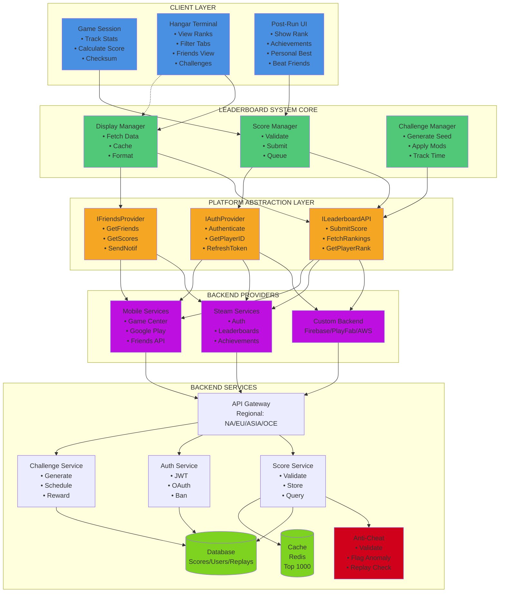
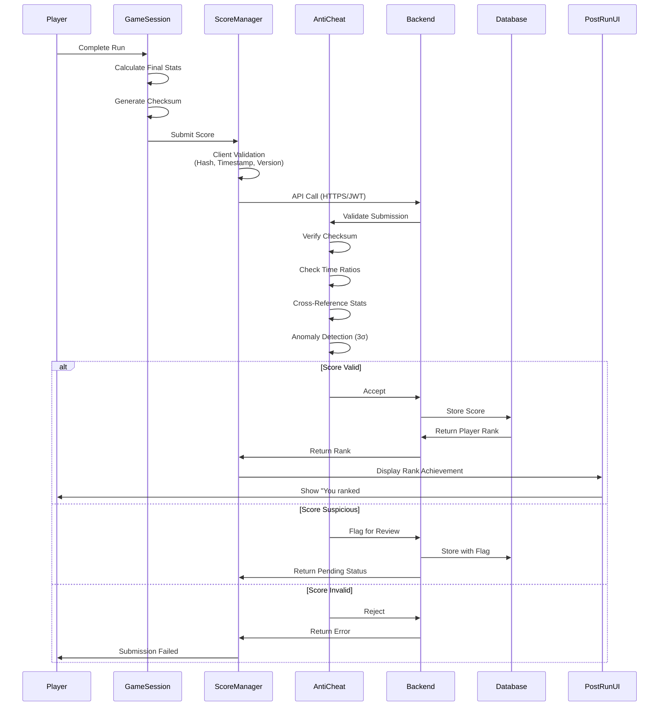
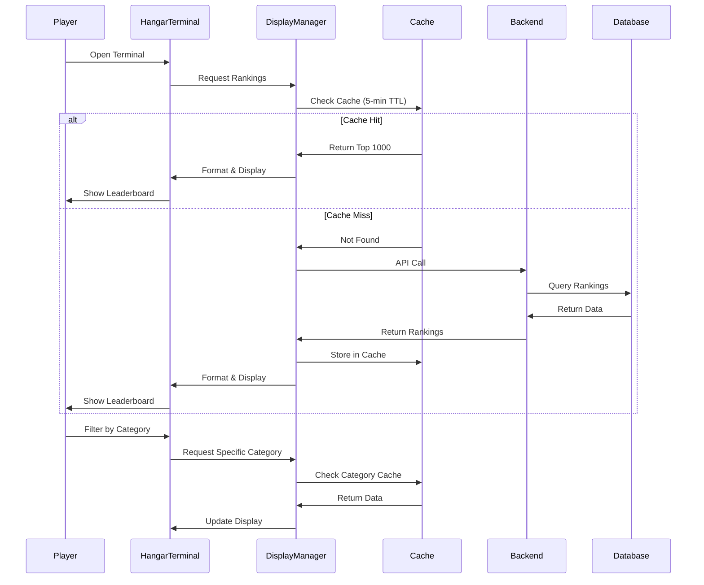
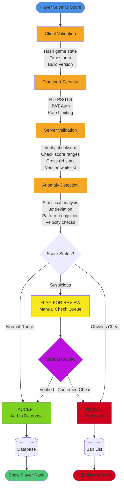
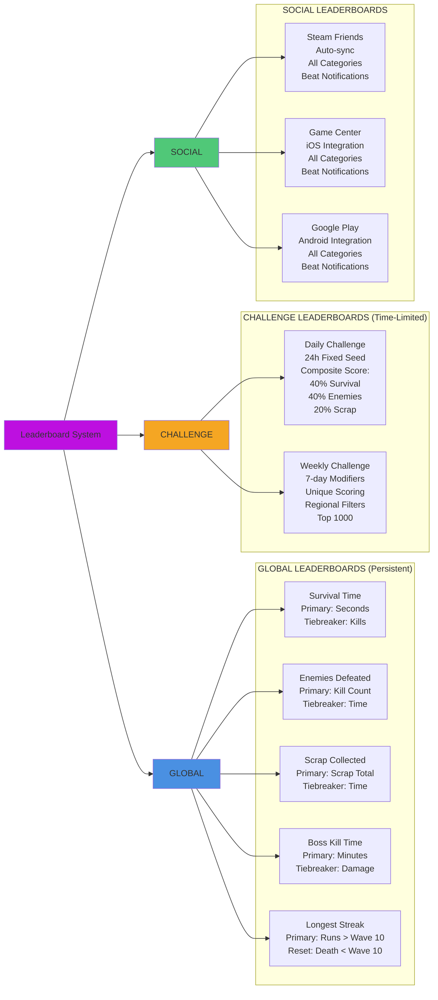
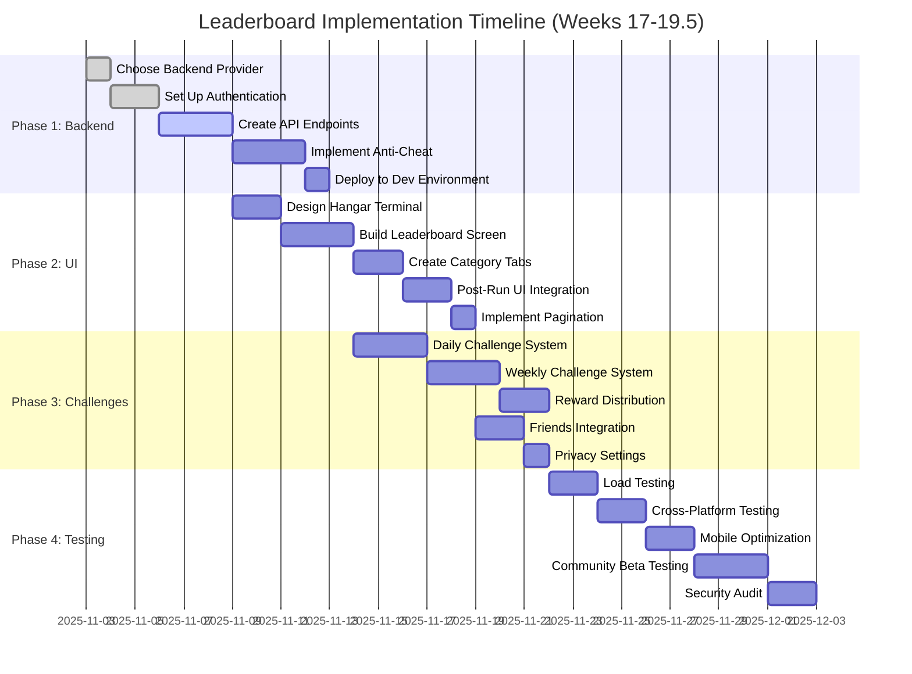
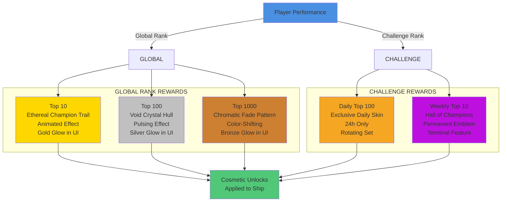
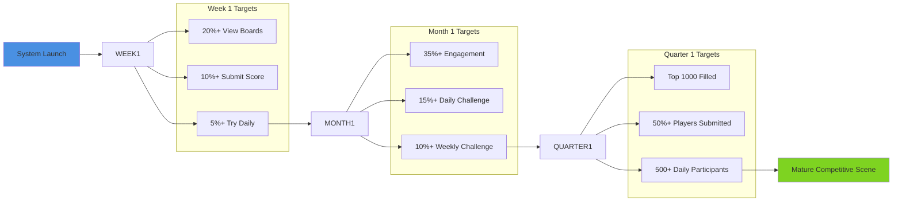
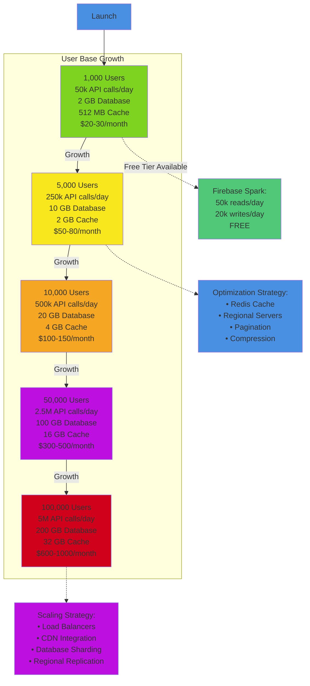

# Leaderboard System Architecture Diagram

> **WARNING: POST-LAUNCH FEATURE - NOT IN INITIAL RELEASE**  
> **Implementation Timeline:** Weeks 17-19 after initial game launch  
> **Reason for Deferral:** System complexity requires dedicated focus on backend infrastructure, anti-cheat, multi-platform integration, and security. Core game will launch first to establish player base and ensure stability before adding competitive features.

## System Architecture Overview

## Score Submission Flow

## Leaderboard Viewing Flow

## Anti-Cheat Security Flow

## Leaderboard Categories Structure

## Implementation Timeline

## Reward Structure

## Success Metrics Dashboard

## Cost Scaling Estimates

---

## Technical Notes

### Firebase Free Tier Limits
- **Spark Plan (Free):** 50k reads/day, 20k writes/day
- **Blaze Plan (Pay-as-you-go):** $0.06 per 100k reads, $0.18 per 100k writes

### Redis Cache Configuration
- Top 1000 entries cached per category
- 5-minute TTL (Time To Live)
- Significantly reduces database load
- Estimated 70-80% reduction in API calls

### Regional Server Distribution
- **NA:** North America (AWS us-east-1)
- **EU:** Europe (AWS eu-west-1)
- **ASIA:** Asia Pacific (AWS ap-southeast-1)
- **OCE:** Oceania (AWS ap-southeast-2)
- Regional replication increases costs ~30%

### Anti-Cheat Statistical Thresholds
- **Normal Range:** Within 3σ (standard deviations) of mean
- **Suspicious:** 3σ to 5σ deviation → Flagged for manual review
- **Obvious Cheat:** >5σ deviation → Automatic rejection + ban

---

**End of Architecture Diagrams**

