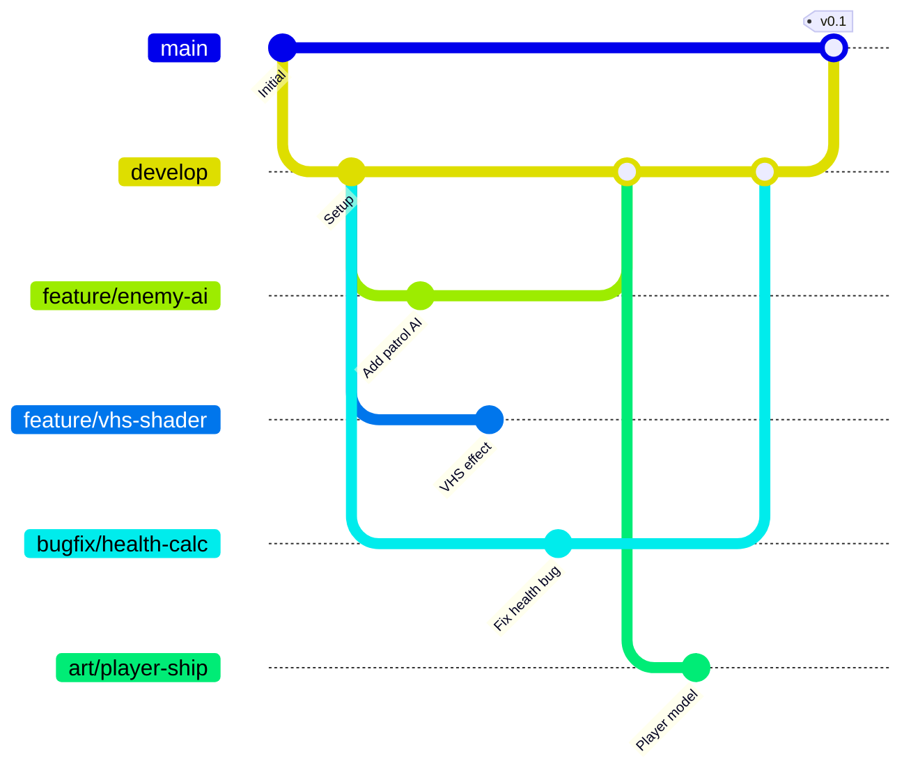

# Contributing to The Invasion: Reforged

Want to help build this? Great. Here's what you need to know.

This project follows SOLID principles and clean code practices. No shortcuts, no hacks.

---

## Before You Start

Read these in order:
1. [README.md](README.md) - Project overview
2. [START_HERE.md](Assets/Documents/00_Core/START_HERE.md) - Current week tasks
3. [GDD.md](Assets/Documents/01_Domain/Design/GDD.md) - Game design

**You need:**
- Unity 2022.3 LTS
- Rider or Visual Studio 2022
- Git configured
- Blender 3.6+ (if doing art)

---

## Project Overview

**What:** 3D space shooter roguelite where you're the alien  
**Engine:** Unity 2022.3 LTS (URP)  
**Timeline:** 14 weeks to Early Access  
**Architecture:** SOLID principles, test-driven, data-driven

**Current Phase:** Check [MASTER_PRODUCTION_SCHEDULE.md](Assets/Documents/02_Production/Schedule/MASTER_PRODUCTION_SCHEDULE.md) for current week.

---

## Essential Documentation

### For Programmers
1. **[Assets/Documents/01_Domain/Technical/UNITY_CLEAN_ARCHITECTURE.md](Assets/Documents/01_Domain/Technical/UNITY_CLEAN_ARCHITECTURE.md)** - Architecture & code patterns

### For Artists
1. **[Assets/Documents/01_Domain/Technical/LOW_POLY_VHS_GUIDE.md](Assets/Documents/01_Domain/Technical/LOW_POLY_VHS_GUIDE.md)** - Art style guide

### For Designers
1. **[Assets/Documents/01_Domain/Design/GDD.md](Assets/Documents/01_Domain/Design/GDD.md)** - Complete game design

---

## Development Workflow

### Branch Strategy



**Branch Types:**
- `main` - Production-ready code (protected)
- `develop` - Integration branch
- `feature/*` - New features
- `bugfix/*` - Bug fixes
- `art/*` - Art assets

### Creating a Feature
```powershell
# 1. Pull latest develop
git checkout develop
git pull origin develop

# 2. Create your feature branch
git checkout -b feature/your-feature-name

# 3. Work on your feature
# ... make changes ...

# 4. Commit with clear messages
git add .
git commit -m "feat: Add enemy patrol AI behavior"

# 5. Push and create Pull Request
git push origin feature/your-feature-name
```

### Commit Message Convention
```
feat: Add new feature
fix: Bug fix
docs: Documentation only
style: Formatting, missing semicolons
refactor: Code restructuring
test: Adding tests
chore: Build tasks, package updates
art: 3D models, textures, animations
```

---

## Contributing Art Assets

### Art Guidelines
- **Low-poly style**: 500-3000 triangles per model
- **Flat shading**: No smooth normals
- **Vibrant colors**: 80s/90s arcade palette
- **VHS aesthetic**: Will be post-processed

### File Naming Convention
```
Assets/Art/
├── Models/
│   ├── Player/
│   │   └── PLR_Ship_Alien_01.fbx
│   ├── Enemies/
│   │   ├── ENM_Scout_Human_01.fbx
│   │   └── ENM_Fighter_Human_01.fbx
│   └── Environment/
│       └── ENV_Asteroid_01.fbx
├── Materials/
│   └── MAT_Ship_Alien_Red.mat
└── Textures/
    └── TEX_Ship_Alien_Diffuse.png
```

**Naming Pattern:** `[TYPE]_[Name]_[Variant]_[Number]`
- **PLR** = Player
- **ENM** = Enemy  
- **ENV** = Environment
- **MAT** = Material
- **TEX** = Texture

### Importing Models
1. Export from Blender as `.fbx`
2. Place in appropriate `Assets/Art/Models/` subfolder
3. Set import settings:
   - Scale Factor: 1
   - Generate Colliders: No (we add manually)
   - Normals: Calculate (for flat shading)

---

## Contributing Code

### Code Style
- **C# Conventions**: Follow [Microsoft C# Guidelines](https://docs.microsoft.com/en-us/dotnet/csharp/fundamentals/coding-style/coding-conventions)
- **Interface-first**: Always depend on interfaces, not concrete classes
- **SOLID principles**: Every class has ONE responsibility
- **No singletons**: Use dependency injection

### Example: Creating a New Enemy Behavior
```csharp
// 1. Define interface (if new behavior type)
public interface ISpecialAbility
{
    void ExecuteAbility(GameObject target);
}

// 2. Implement as ScriptableObject for data-driven design
[CreateAssetMenu(menuName = "Abilities/Teleport")]
public class TeleportAbility : SpecialAbility, ISpecialAbility
{
    [SerializeField] private float teleportRange = 10f;
    
    public void ExecuteAbility(GameObject target)
    {
        // Implementation
    }
}

// 3. Write unit test FIRST (TDD)
[Test]
public void TeleportAbility_MovesEnemyToRandomPosition()
{
    // Arrange
    var ability = ScriptableObject.CreateInstance<TeleportAbility>();
    var enemy = new GameObject();
    
    // Act
    ability.ExecuteAbility(enemy);
    
    // Assert
    Assert.IsTrue(/* verify teleport happened */);
}
```

### Testing Requirements
- **All new features**: Must have unit tests
- **Coverage target**: 90%+ for business logic
- **Run tests before PR**: `Ctrl+Alt+T` in Rider

### Code Review Checklist
Before submitting PR:
- [ ] Code follows SOLID principles
- [ ] All public methods have XML documentation
- [ ] Unit tests written and passing
- [ ] No compiler warnings
- [ ] ScriptableObjects used for configuration
- [ ] No `FindObjectOfType()` or `GameObject.Find()`
- [ ] Interfaces used for dependencies

---

## Reporting Issues

### Bug Report Template
```markdown
**Description:**
What went wrong?

**Steps to Reproduce:**
1. Open scene X
2. Click Y
3. See error Z

**Expected Behavior:**
What should happen?

**Screenshots/Logs:**
Attach console errors

**Environment:**
- Unity Version: 2022.3.X
- OS: Windows 11
- Commit SHA: abc123
```

### Feature Request Template
```markdown
**Feature:**
What do you want to add?

**Use Case:**
Why is this needed?

**Design Impact:**
Does this change game design?

**Technical Approach:**
How would you implement it?
```

---

## Architecture Principles

### Core Rules (Non-Negotiable)
1. **Interface Segregation**: Small, focused interfaces
2. **Dependency Injection**: Components get dependencies through constructor/properties
3. **Data-Driven Design**: Use ScriptableObjects for configuration
4. **Event-Driven**: Components communicate through events, not direct references
5. **Testability**: Every system can be unit tested in isolation

### Example: Proper Dependency Injection
```csharp
// ❌ BAD - Tight coupling, can't test
public class EnemyBrain : MonoBehaviour
{
    void Start()
    {
        var stats = GetComponent<CharacterManager>();
        var movement = GetComponent<EntityMovement>();
    }
}

// ✅ GOOD - Loose coupling, testable
public class EnemyBrain : MonoBehaviour
{
    [SerializeField] private CharacterManager stats;
    [SerializeField] private EntityMovement movement;
    
    // Can be injected in tests
    public void Initialize(IStatProvider stats, IMovable movement)
    {
        // ...
    }
}
```

---

## Project Structure

```
Assets/
├── Art/                    # 3D models, textures, materials
│   ├── Models/
│   ├── Materials/
│   └── Textures/
│
├── Audio/                  # Music, SFX (future)
│
├── Documents/              # All documentation (you are here!)
│   ├── 00_Core/           # START_HERE.md, README.md
│   ├── 01_Domain/         # Game design & technical docs
│   ├── 02_Production/     # Schedule & launch plans
│   ├── 03_Features/       # Feature specifications
│   └── 04_Marketing/      # Devlogs & marketing
│
├── Scenes/                 # Unity scenes
│   ├── MainMenu.unity
│   ├── Hangar.unity
│   └── Arena_Mars.unity
│
├── Scripts/                # C# game code
│   ├── Contracts/         # Interfaces & enums
│   ├── CharacterCore/     # Stats & health
│   ├── Combat/            # Damage & attacks
│   ├── Locomotion/        # Movement
│   ├── Control/           # AI & input
│   ├── Progression/       # XP & upgrades
│   └── Tests/             # Unit tests
│
├── Settings/              # Unity project settings
└── Prefabs/               # Reusable game objects
```

---

## Time Estimates for Common Tasks

### Programming
- New enemy behavior: **2-4 hours**
- New weapon/attack: **1-3 hours**
- New UI screen: **3-5 hours**
- Bug fix (average): **30 min - 2 hours**

### Art
- Low-poly ship model: **3-5 hours**
- Environment prop: **1-2 hours**
- VFX particle system: **2-3 hours**

### Design
- Balance enemy wave: **1-2 hours**
- Design new upgrade: **30 min - 1 hour**

---

## Current Priorities

**Check this weekly!** Priorities change based on production phase.

### Week 1-6: Art Production (Current)
- [ ] Player ship model
- [ ] 5 enemy types (Scout, Fighter, Tank, Bomber, Carrier)
- [ ] 5 planetary environments
- [ ] VHS post-processing shader
- [ ] UI mockups

### Week 7-14: Gameplay Implementation
- [ ] Core combat loop
- [ ] Enemy AI state machines
- [ ] Progression system
- [ ] Boss encounters
- [ ] Meta-progression (Hangar upgrades)

### Week 15-17: Polish & Launch
- [ ] DevLog videos
- [ ] Steam page setup
- [ ] Demo build
- [ ] Launch trailer

---

## Communication

### Before Starting Work
1. Check [MASTER_PRODUCTION_SCHEDULE.md](Assets/Documents/02_Production/Schedule/MASTER_PRODUCTION_SCHEDULE.md)
2. Announce what you're working on (Discord/Slack)
3. Check if anyone else is working on related systems

### Daily Updates (If Possible)
- What did you complete today?
- What are you working on next?
- Any blockers?

### Code Reviews
- All PRs require **1 approval** before merge
- Reviews should happen within **24 hours**
- Be constructive, not critical

---

## FAQ

### Q: Can I use a different code style?
**A:** No. Consistency is critical in team projects. Follow the established patterns.

### Q: Why so many interfaces?
**A:** Enables unit testing, multiplayer readiness, and easy refactoring. This is professional-grade architecture.

### Q: Can I add a new Unity package?
**A:** Ask first. We keep dependencies minimal for performance and maintainability.

### Q: The schedule seems aggressive. Is this realistic?
**A:** Yes. This follows industry best practices. Scope is carefully controlled.

### Q: Can I add my own feature ideas?
**A:** Yes! But discuss with the team first. Feature creep is a real risk in a 17-week timeline.

### Q: I found a bug in the documentation
**A:** Great! Submit a PR fixing it. Docs are code too.

---

## Learning Resources

### Unity Clean Architecture
- [Unity Clean Architecture](Assets/Documents/01_Domain/Technical/UNITY_CLEAN_ARCHITECTURE.md) - This project's architecture & patterns

### SOLID Principles
- Robert C. Martin - "Clean Architecture" book
- [SOLID in Unity](https://www.youtube.com/watch?v=eIf3-aDTOOA) - Unity tutorial

### Test-Driven Development
- [Unity Test Framework](https://docs.unity3d.com/Packages/com.unity.test-framework@latest)
- Kent Beck - "Test Driven Development: By Example"

---

## Your First Contribution

**Let's get you started!**

### Option 1: Small Code Task (1 hour)
1. Pick a "good first issue" from GitHub Issues
2. Follow the workflow above
3. Submit PR

### Option 2: Documentation (30 min)
1. Read through docs
2. Find typos, unclear sections, or missing info
3. Submit PR with improvements

### Option 3: Art Asset (2-3 hours)
1. Review [LOW_POLY_VHS_GUIDE.md](Assets/Documents/01_Domain/Technical/LOW_POLY_VHS_GUIDE.md)
2. Model a simple environment prop (asteroid, debris)
3. Submit PR with FBX file

---

## Thank You!

Every contribution makes this project better. Whether it's code, art, documentation, or bug reports - **you're helping build something awesome**.

**Questions?** Don't hesitate to ask. We'd rather answer 100 questions than have you stuck.

---

**Last Updated:** November 3, 2025  
**Maintainer:** Anderson Gonçalves  
**Version:** 1.0

