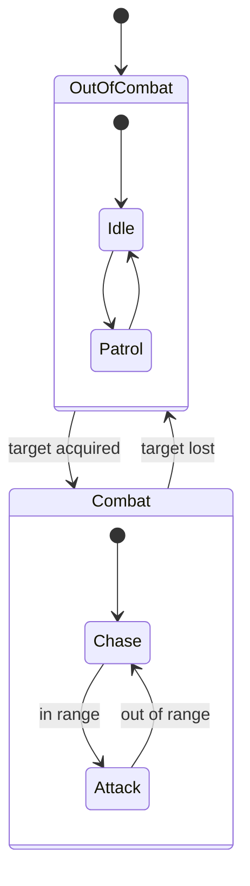

# The Invasion: Reforged

[](https://www.repostatus.org/#wip)
[](https://unity.com/)
[](https://learn.microsoft.com/dotnet/csharp/)
[](#architecture)
[](#enemy-ai)
[](#movement)
[](#gameplay)
[](https://github.com/AndersonGACFilho/The-Invasion-Game)

A 2D retro space shooter that takes the wave survival of *Vampire Survivors*
into top-down arcade action. It is a full remake of
[The Invasion](https://github.com/AndersonGACFilho/The-Invasion-Game), the
game I wrote in my first semester of university, rebuilt to find out how far
gameplay code can be pulled apart before it stops being one system.

The script is flipped: you are the lone alien survivor holding off endless
human fleets, scavenging their scrap to evolve a ship that ends each run
looking nothing like it started.

## Gameplay

**Survive. Evolve. Annihilate.** Experience from fallen enemies buys a choice
between random upgrades, so every run builds a different ship.

### Alien artifacts

Elite enemies can drop supply crates holding artifacts. An artifact is a
permanent buff **for the rest of the current run**, large enough to change how
the run is played rather than nudge a number. The **Luck** attribute governs
how often they appear.

| Artifact              | Effect                                                                             |
|-----------------------|-------------------------------------------------------------------------------------|
| **Mega Bomb Core**    | Does not explode. Integrates into the ship: every level-up now also detonates around you. |
| **Overcharged Hull**  | A large permanent gain to damage and fire rate, paid for with maximum health.        |
| **Quantum Thrusters** | Briefly phase through enemies and projectiles after taking damage.                   |

### Attributes

| Attribute             | What it governs                          |
|-----------------------|-------------------------------------------|
| Thrusters Potency     | Base movement speed.                      |
| Hull Integrity        | Ship health.                              |
| Deflection Matrix     | Regenerating shield that absorbs damage.  |
| Evasion Thrusters     | Chance to evade incoming projectiles.     |
| Nanobots              | Passive health regeneration.              |

### Upgrades

**Offensive** — Cooldown Reduction, Energy Amplifier, Projectile Velocity,
Blast Radius, Multishot, Effect Duration.

**Utility** — Tractor Beam Range, Data Analysis, Luck, Scrap Multiplier and
Tech Diagram, the last of which feeds meta-progression between runs.

## Architecture

The point of the remake is the shape of the code. Responsibilities are split
into modules, and the two decisions that carry the most weight are the enemy
state machine and the movement strategies.

```
Assets/Code/
├── Control Module/       Who decides what an entity does
│   ├── EntityController.cs
│   ├── Player/PlayerInputController.cs
│   ├── Enemy/EnemyBrain.cs · EnemyAIContext.cs
│   └── HSTM/             Hierarchical state machine and its states
├── Locomotion Module/    How an entity moves once something decided
│   ├── EntityMovement.cs
│   ├── MovementStrategy.cs
│   └── Enemy/MovementStrategies/
├── Stats/EntityStats.cs
├── Interfaces/IMovable.cs
└── UI Module/Widgets/
```

### Enemy AI

Enemy behaviour is a **hierarchical** state machine rather than a flat one,
so shared behaviour lives in the superstate instead of being copied across
siblings.



`EnemyBrain` owns the machine, `EnemyAIContext` carries the shared state the
states read, and each state derives from `EntityStateBase`.

### Movement

`MovementStrategy` is a **ScriptableObject**. A new way of moving is a new
asset, not an edit to the mover: `EntityMovement` never learns about melee,
ranged, patrol or idle behaviour, it just runs whichever strategy it was
handed.

This is the Open/Closed Principle where it actually pays off, and it is what
lets an enemy swap movement mid-run as its state changes.

### SOLID in practice

| Principle | Where it shows                                                                                  |
|-----------|--------------------------------------------------------------------------------------------------|
| **SRP**   | `PlayerInputController` reads input and nothing else; `EntityMovement` applies motion and nothing else. |
| **OCP**   | Movement strategies are ScriptableObjects, so the set grows without touching the mover.          |
| **LSP**   | `IMovable` lets any entity be moved by the same code, player or enemy.                           |
| **ISP**   | Interfaces stay small and single-purpose rather than one entity contract.                        |
| **DIP**   | Control depends on abstractions over locomotion, not on the concrete movers.                     |

Damage is still handled concretely. An `IDamageable` seam, so projectiles can
hit anything that implements it, is the next piece of this work rather than
something already in place.

## Running it

```bash
git clone https://github.com/AndersonGACFilho/TheInvasionReforged
```

Open in Unity Hub with editor **6000.2.8f1**, load `Assets/Scenes/Main.unity`
and press Play.

## History

The repository previously held an Unreal Engine 5.7 prototype of the same
idea, with a `TIRCore` module of gameplay interfaces. That direction was set
aside in favour of Unity, and the work is preserved on the
[`unreal-prototype`](https://github.com/AndersonGACFilho/TheInvasionReforged/tree/unreal-prototype)
branch.

## Related

- [The Invasion](https://github.com/AndersonGACFilho/The-Invasion-Game) — the
  original, written in C++ with Allegro 5 and
  [playable in the browser](https://andersongacfilho.github.io/play/the-invasion).
